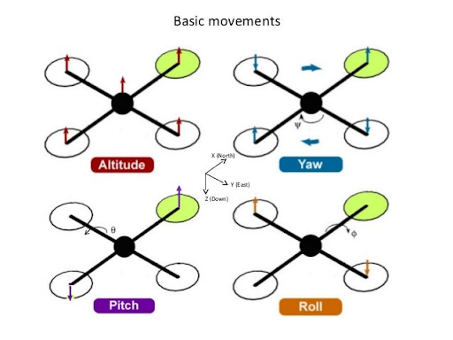
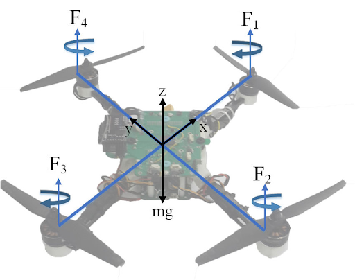
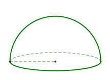

# Final Report

## Video
[Video](assets/videos/video1521424387.mp4)

## Project Summary

Our project explores reinforcement learning (RL) for quadrotor stabilization using two physics engines: Drake and PyFlyt. The primary goal was to train a PPO policy to maintain stable hover and potentially lay the foundation for waypoint navigation. This project required handling complex state observations, reward shaping, environment tuning, and attempted hyperparameter optimization.

We successfully solved the hover task using Stable-Baselines3 PPO, with experiments in both physics environments. Our final policy stabilizes the quadrotor from multiple initial conditions. We also attempted working towards dynamic waypoint-following

12D state space: position, velocity, rotation, angular velocity

## Approaches

### Bsaelines

LQR Controller - Tested as a traditional control baseline in Drake
Random Policy - Used to compare against learned PPO policies.

### Proposed RL approach

- PPO with 12D state observation (position, velocity, rotation, angular velocity).

Action space:

-- Collective thrust + angular rates (PyFlyt)
-- Individual motor thrusts (Drake)

Reward: Negative L2 distance to target + yaw rate penalty.

Termination: Exiting a radius-3 dome or 5000 steps.

Hyperparameter tuning with Optuna explored optimal n_steps, batch_size, gamma, and learning_rate, however, lead to minimal results.

Reward shaping and termination conditions

## Evaluation

- PPO solved the PyFlyt hover task in under 1M timesteps.

- Drake PPO solved after adding termination conditions.

- Evaluation includes TensorBoard metrics, trajectory visualizations, and video rollouts.

- Comparison between PPO Policy and LQR Controller shows PPO generalizes better from offset starts.

Waypoint Tasks: Initial experiments include placeholder environment stubs and reward modifications based on L2 distance to dynamic waypoints.

[PPO vs LQR performance](assets/videos/drake_quadrotor_hover.mp4)
[PPO vs LQR performance](assets/videos/drake_quadrotor_lqr.mp4)

PPO policy generalizes better from offset starts compared to LQR (PPO on left, LQR on right)

## References

- Stable-Baselines3 (RL Library)
- PyFlyt Documentation 
- Drake Examples and LQR Baseline
- OpenAI Gymnasium
