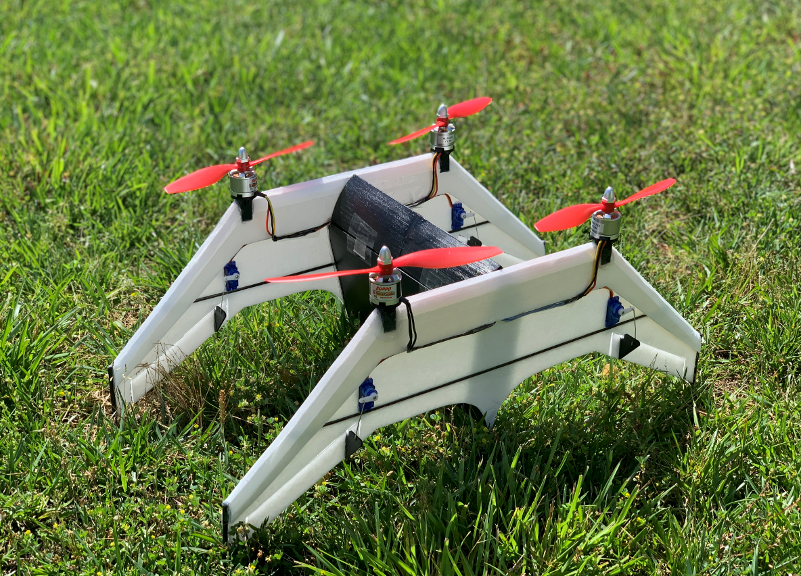

AeroMind is an innovative project aimed at developing an autonomous quadrotor control system using RL (reinforcement learning) and LQR (Linear Quadratic Regulator) control techniques. We will leverage PyDrake and PyFlyt.Our end goal is to put together a reliable agent capable of stable flight through real-time training in simulated environments. 

{: style="width:300px;"}

Reports:

- [Proposal](proposal.html)
- [Status](status.html)
- [Final](final.html)

Source Code: [AeroMind GitHub Repository](https://github.com/fermayda/AeroMind)

